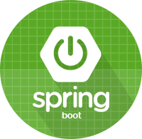
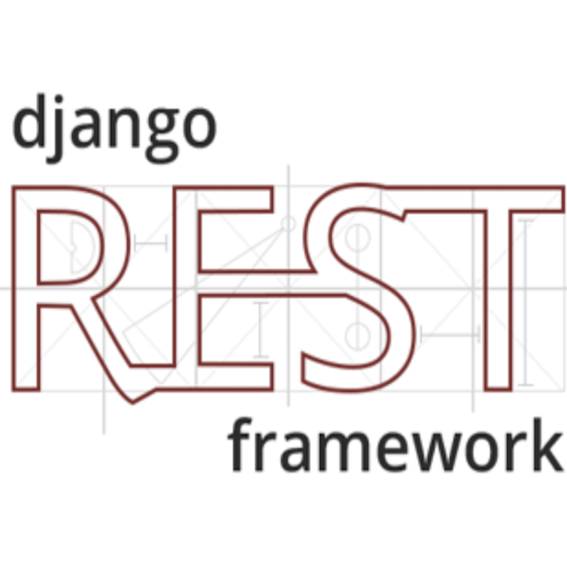
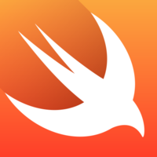
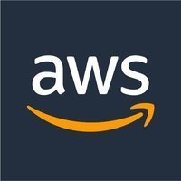

# Resume

### 박규혁
kh2000park@gmail.com  
`#1990년생` `#Programmer` `#서울동작구사당동`  

## Skills
(커서를 올리면 텍스트가 보입니다.)
#### Backend
    

    

#### Frontend
   

#### Mobile
  

 

#### Infrastructure
  

  

#### Software Development Process
TiDD with Jira, Bitbucket, Bamboo

#### Communication Tools
Slack, Zeplin, Notion, Realtime Board, Confluence

#### Monitoring Tools
Jennifer, Pinpoint

#### And more tools...
Kong, Sonarqube, Swagger, Jenkins

## Careers

#### SK엔카닷컴
2018.04.09 ~ 2019.04.12  
Backend Developer, 주임

#### 러블리에프앤티
2016.02.12 ~ 2018.02.02  
Software Engineer

## Projects

### @SK엔카닷컴

##### [엔카 매거진](https://www.encarmagazine.com/) API 전환 프로젝트  
- 기간: 2018.12~2019.04
- 개요: API 프레임워크 전환(Play Framework -> Spring Boot), API Endpoint 변경
- 사용기술: Spring Boot, JPA, React.js

##### Back-office System 프로젝트
- 기간: 2019.03~2018.04
- 개요: 딜러 컨설팅 업무 중 필요한 데이터 시각화 시스템 구축
- 사용기술: Spring Boot
- 담당업무: API 개발

##### 정산자동화 프로젝트
- 기간: 2018.12~2018.02
- 개요: 관리자 페이지 내 정산자동화 시스템 구축
- 사용기술: Spring MVC, Spring Boot
- 담당업무: Frontend 개발

##### 모바일진단 프로젝트  
- 기간: 2018.08~2018.11
- 개요: 사내 차량 진단 관리 시스템 구축
- 사용기술: Spring Boot, React.js, Bamboo, AWS Elastic Beanstalk
- 담당업무: API 개발, 인증 구현, Frontend Server CI/CD 구성

##### 미네르바 대학 산학협력 프로젝트 (사회공헌)  
- 기간: 2018.08~2019.12
- 개요: 미네르바 대학 학생들의 웹앱 개발 프로젝트 관리
- 담당업무: PM, 학생 Recruiting 및 관리, 웹개발 지원
- 관련 보도자료 : http://www.asiatoday.co.kr/view.php?key=20181019010010812

##### [엔카 웹](https://www.encar.com/), [엔카 모바일 웹](https://m.encar.com/) 유지보수  
- 개요: 운영 이슈 및 버그 개선 다수
- 사용기술: Spring MVC

##### SBT 데이터 송출 Batch 개발
- 기간: 2018.06
- 개요: 일본 중고차 거래 플랫폼 "SBT"에 엔카 정보를 송신해주는 Batch 개발

### @러블리에프앤티
##### RicoPlace
- 기간: 2017.01~2018.02
- 개요: 요식업 매장관리 앱 개발
- 사용기술: Java, RxJava, Android, Swift, RxSwift, Cocoa Touch Framework, Django, Django REST Framework, PostgreSQL, Firebase, MVVM Pattern
- 담당업무: 서버, iOS, Android 개발

##### Jutopia
- 기간: 2016.02~2017.01
- 개요: 음료 관련 정보 및 리뷰 커뮤니티 개발
- 사용기술: Java, Android, Swift, Cocoa Touch Framework, php-mysql
- 담당업무: 서버, iOS, Android 개발

### @개인프로젝트
##### 레알밥도둑 [Android](https://goo.gl/p4tKq3) [iOS](https://goo.gl/t5QASU)
- 기간: 2017.06~2017.10, 현재 유지보수 중
- 개요: 음료 관련 정보 및 리뷰 커뮤니티 개발
- 사용기술: Java, Android, Swift, Cocoa Touch Framework, Django, Django REST Framework
- 담당업무: 서버, iOS, Android 개발

##### 무민이 [Android](https://goo.gl/jNiXtZ) [iOS](https://goo.gl/zjz51x)
- 기간: 2016.08-2016.10, 2017.04-2017.06
- 개요: 음료 관련 정보 및 리뷰 커뮤니티 개발
- 사용기술: Java, Android, Swift, Cocoa Touch Framework, php-mysql
- 담당업무: 서버, iOS, Android 개발

## Education
#### Framework를 활용한 빅데이터 개발 전문가 과정, 쌍용정보통신교육센터
2015.07 - 2015.12  
[국가기간산업직종훈련]  
- 실습 위주의 Java기반 웹프로그래밍 학습  
- Java, JSP, HTML, CSS, Javascript, jQuery, MyBatis, Spring Framework, Hadoop, 검색-분석-시각화-예측 학습  
- 자바 게임 프로젝트, MVC구조를 활용한 웹앱 프로젝트, 빅데이터 개발 프로젝트 진행

#### 한국외국어대학교
2009.03 - 2015.02  
일본지역학(주전공), 영어통번역학(복수전공)

## Certificates
정보처리기사 / 한국산업인력공단, 2017.05 취득

## 기타
#### 병역사항
군필 / 공군 병장 만기 전역  
2012.02 - 2014.02
